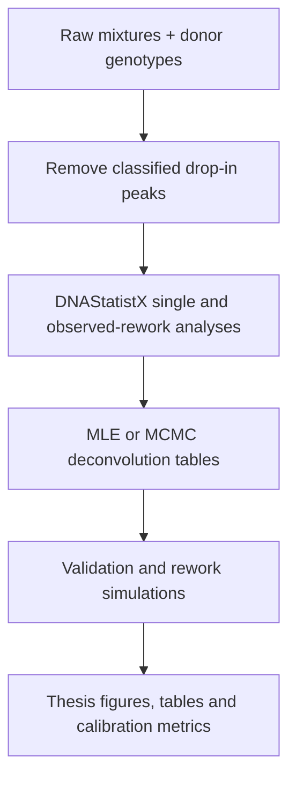

# Thesis reproducibility guide

This document maps the analyses in [`MSc_Thesis_Jort_Koks.pdf`](MSc_Thesis_Jort_Koks.pdf) to the Python code in this repository. It is intended to answer three questions:

1. Which script implements each part of the methodology?
2. Which script or intermediate file produced each reported result, figure, and table?
3. In what order should the code be run to repeat the analysis?

The thesis is titled *Statistical analysis of replicate measurements of DNA mixtures*.

## Reproducibility status

The repository contains the main preprocessing, deconvolution, MCMC, simulation, validation, and plotting code. However, exact numerical reproduction of the submitted thesis is not currently possible from the public files alone.

The main reasons are:

- The full research dataset is owned by the Netherlands Forensic Institute (NFI) and is not included. The included `dataset_example/` directory is suitable for understanding the file format and testing a small part of the workflow, but not for reproducing the reported results.
- DNAStatistX is NFI-owned software and its JAR file is not distributed publicly. The thesis used `dnastatistx-cli-2.5.0-DES-700-202601191653.jar`. The full dataset and this JAR can be requested from the NFI.
- Several scripts still contain absolute Windows paths that must be changed before they can be run on another computer.
- Some checked-in defaults are short test settings rather than the settings used for the thesis. The differences are listed in [Thesis settings versus checked-in defaults](#thesis-settings-versus-checked-in-defaults).
- Several thesis figures were displayed with `plt.show()` and selected or combined manually. They are not all saved under stable filenames.
- The 16 values in Table 12.1 are manually entered in `OLS_results.py`; that script analyses the values but does not generate them from the 16 simulation runs.

Consequently, this guide distinguishes three kinds of thesis content:

- **Direct**: the script directly computes and plots or saves the result.
- **Derived**: the script computes the data, but the thesis figure or table was selected, combined, or formatted manually.
- **Manual**: the item is explanatory thesis content and was not generated by a Python script in this repository.

## Repository components

The important project directories are:

```text
dataset_example/                         Example donor and mixture files
python_scripts/
  1_mixture2deconvolution/               Preprocessing, DNAStatistX, MLE and MCMC deconvolution
  2_simulation_algorithm/                Frequentist/Bayesian rework simulation pipeline
  3_validation_and_diagnostics/          Validation, comparisons and thesis plots
  helpers/                                Shared probability-model and MCMC functions
resources/                               DNAStatistX and model configuration files
```

## Required inputs and software

### Python and Java

Create an environment and install the direct Python dependencies from the repository root:

```bash
python -m venv .venv
```

On Windows:

```powershell
.venv\Scripts\Activate.ps1
python -m pip install -r requirements.txt
```

On macOS or Linux:

```bash
source .venv/bin/activate
python -m pip install -r requirements.txt
```

Java must also be installed and available through the `java` command because DNAStatistX is called through `subprocess`.

### Required data and resources

| Item | Purpose | Publicly included? |
|---|---|---:|
| Full 2-person high-threshold PPF6C dataset | Produces the 87 single-profile and 29 observed-rework cases used in the thesis | No; request from the NFI |
| Donor genotype files | Identify the known true donors and remove peaks classified as drop-in | Only examples are included |
| `dnastatistx-cli-2.5.0-DES-700-202601191653.jar` | MLE fitting, deconvolution and artificial-profile generation | No; request from the NFI |
| `NFI_frequencies.csv` | Population allele frequencies and genotype priors | Expected in `resources/` |
| `reference_file.txt` | DNAStatistX reference-profile input | Expected in `resources/` |
| `kit_properties_txt.txt` | PPF6C allele fragment lengths used by the degradation model | Expected in `resources/` |
| [`resources/config.yaml`](resources/config.yaml) | Kit, thresholds, model, fractional threshold, drop-in settings and random seed | Yes |

The code expects these resource filenames. Verify that they exist before running the pipeline.

### Dataset structure

The raw mixture filename convention is:

```text
<replicate>_<dataset><mixture-type><number-of-contributors>.txt
```

For example, `1_3A2.txt` is replicate 1, donor dataset 3, mixture type A, with two contributors.

The thesis uses:

- six donor datasets: 1 through 6;
- five mixture types: A through E;
- three replicate profiles per underlying mixture;
- two contributors;
- high detection thresholds;
- all cases except mixture `3B2`, for which all three profiles were unavailable.

This gives 87 single profiles and 29 underlying mixtures/observed rework profiles.

## Configure paths before running

The four base-analysis scripts share [`python_scripts/1_mixture2deconvolution/pipeline_config.py`](python_scripts/1_mixture2deconvolution/pipeline_config.py). At minimum, change:

```python
INPUT_DOCUMENTS_DIR = Path(...repository root...)
OUTPUT_DOCUMENTS_DIR = Path(...desired output parent...)
```

Then confirm the derived paths for:

- `RAW_DATASET_DIR`;
- `RAW_MIXTURE_DIR`;
- `DONOR_DIR`;
- `RESOURCES_PATH`;
- `ANALYSIS_DIR`;
- the DNAStatistX and MCMC output roots.

The simulation and diagnostic scripts do not all use `pipeline_config.py`. Their path blocks must also be changed:

- [`python_scripts/2_simulation_algorithm/a_main_simulation_algorithm.py`](python_scripts/2_simulation_algorithm/a_main_simulation_algorithm.py)
- [`python_scripts/2_simulation_algorithm/f_extract_rework_LRs.py`](python_scripts/2_simulation_algorithm/f_extract_rework_LRs.py)
- [`python_scripts/2_simulation_algorithm/g_plot_rework_LRs.py`](python_scripts/2_simulation_algorithm/g_plot_rework_LRs.py)
- all scripts in [`python_scripts/3_validation_and_diagnostics/`](python_scripts/3_validation_and_diagnostics/)

Do not run the full pipeline until all remaining `C:\Users\...` paths point to valid locations.

## Overall data flow



## Base analysis: run order

Run the scripts below from `python_scripts/1_mixture2deconvolution/`.

### 1. Remove peaks classified as drop-in

```bash
python a_remove_dropins.py
```

[`a_remove_dropins.py`](python_scripts/1_mixture2deconvolution/a_remove_dropins.py) compares every observed allele with the alleles in the known donor profiles. Alleles absent from all true donors are removed. It writes:

- cleaned mixture files to `DROPIN_OUTPUT_MIXTURES_DIR`;
- one human-readable removal log per mixture to `DROPIN_OUTPUT_LOG_DIR`.

This preprocessing implements the cleaned data setting introduced in Sections 5.4 and 5.5.

### 2. Run DNAStatistX on every cleaned single profile

```bash
python b_dnastatistx_single_mixtures.py
```

[`b_dnastatistx_single_mixtures.py`](python_scripts/1_mixture2deconvolution/b_dnastatistx_single_mixtures.py) runs the H2 analysis separately for each replicate. It then calls `helpers/postprocess_add_priors.py` to add genotype priors and donor-specific LR columns.

Important outputs include:

```text
output_2p_dnax_raw/
  run_parameters_PIPELINE.txt
  run_parameters_PIPELINE.json
  mixtures/<single-profile-id>/
    results.json
    results_joint_deconvolution_H2.csv
    results_joint_deconvolution_H2_clean.csv
    results_marginal_deconvolutions_with_prior_and_LR.csv
```

### 3. Run DNAStatistX on the observed three-replicate profiles

```bash
python c_dnastatistx_rework_mixtures.py
```

[`c_dnastatistx_rework_mixtures.py`](python_scripts/1_mixture2deconvolution/c_dnastatistx_rework_mixtures.py) combines replicates 1, 2 and 3 for each underlying mixture and runs one H2 analysis. These are the observed laboratory rework analyses used in Chapters 6, 8, 10 and 12.

### 4. Create MLE or Bayesian deconvolution tables

```bash
python d_create_deconv_tables_draws.py
```

[`d_create_deconv_tables_draws.py`](python_scripts/1_mixture2deconvolution/d_create_deconv_tables_draws.py) is the central implementation of the peak-height likelihood, deconvolution, marginalization, Bayesian LR vectors, and MCMC output handling.

Its main switch is:

```python
parameter_method = "MLE"   # frequentist plug-in analysis
# or
parameter_method = "MCMC"  # Bayesian analysis
```

It can run both single-profile and observed-rework analyses. The main outputs are:

```text
<output root>/mixtures/<mixture>/
  results_joint_deconvolution_H2_clean.csv
  results_marginal_prior_LR.csv
  results_dnax.json
  results_mcmc.json                  # MCMC only
```

For Bayesian output, probability and LR columns contain JSON-encoded vectors, including:

- `Posterior_probability_draws`;
- `Marginal_probability_draws`;
- `LR(a)_draws`.

Run the MLE and MCMC configurations into different output directories. Otherwise, one run can overwrite the other.

## Mathematical framework to code mapping

| Thesis material | Implementation |
|---|---|
| Gamma peak-height model and degradation, Sections 3.2-3.4 | [`helpers/euroformix_gamma_model.py`](python_scripts/helpers/euroformix_gamma_model.py) |
| Allele frequencies, genotype enumeration and genotype priors | [`helpers/genotypes.py`](python_scripts/helpers/genotypes.py) |
| Adding priors and LR columns to DNAStatistX output | [`helpers/postprocess_add_priors.py`](python_scripts/helpers/postprocess_add_priors.py) |
| Joint and marginal deconvolution, approximate donor LR, Sections 3.8-3.9 | [`d_create_deconv_tables_draws.py`](python_scripts/1_mixture2deconvolution/d_create_deconv_tables_draws.py) |
| Bounded parameter transformations, priors and Jacobian, Sections 9.3-9.4 | [`helpers/mcmc_parameters.py`](python_scripts/helpers/mcmc_parameters.py) |
| Random-walk Metropolis-Hastings sampler, Section 9.5 | [`helpers/mcmc_parameters.py`](python_scripts/helpers/mcmc_parameters.py) |
| Percentiles, KS statistic, coverage and interval score, Section 3.10 | `validate_single_LR_coverage.py`, `validate_rework_LR_coverage.py`, and `g_plot_rework_LRs.py` |

## Validation pipeline for Chapters 5, 6 and 10

### Single-profile validation

Use [`validate_single_LR_coverage.py`](python_scripts/3_validation_and_diagnostics/validate_single_LR_coverage.py).

The script:

1. reads each marginal deconvolution table;
2. identifies the true major and minor donors;
3. computes the true-donor LR;
4. samples donor genotypes from the marginal deconvolution;
5. calculates the true-donor percentile, 95% coverage and interval score;
6. writes `percentile_df_<version>.csv`, an outlier table, summary CSVs, and percentile histograms when saving is enabled.

Point `OUT_ROOT` to the MLE result root for Chapter 5 and to the MCMC result root for Chapter 10.4.

### Observed-rework validation

Use [`validate_rework_LR_coverage.py`](python_scripts/3_validation_and_diagnostics/validate_rework_LR_coverage.py).

It performs the same analysis for the 29 combined three-replicate profiles. Point `OUT_ROOT` to the MLE rework root for Chapter 6 and to the MCMC rework root for Chapter 10.5.

### Comparisons between MLE, MCMC, single and rework results

Use [`percentile_analysis_Bayes.py`](python_scripts/3_validation_and_diagnostics/percentile_analysis_Bayes.py). This file contains several analysis blocks that were developed at different stages of the thesis. Its active blocks compare:

- single-profile MLE with single-profile MCMC;
- observed-rework MLE with observed-rework MCMC;
- single profiles with observed rework profiles under either `APPROACH = "MLE"` or `APPROACH = "BAYES"`;
- LR gain with drop-out and estimated mixture proportion.

The script expects previously saved `percentile_df_*.csv` files. Update every path before running it. It currently displays figures rather than saving them under thesis figure numbers.

## Rework simulation pipeline for Chapters 7, 8, 11 and 12

[`a_main_simulation_algorithm.py`](python_scripts/2_simulation_algorithm/a_main_simulation_algorithm.py) orchestrates the simulation modules in this order:

| Order | Script | Role in the algorithms |
|---:|---|---|
| 1 | [`b_sample_from_joint_deconv.py`](python_scripts/2_simulation_algorithm/b_sample_from_joint_deconv.py) | Samples one complete joint contributor-genotype pair per locus and replaces `Ø` alleles using population frequencies |
| 2 | [`c_generate_rework_mixtures.py`](python_scripts/2_simulation_algorithm/c_generate_rework_mixtures.py) | Uses DNAStatistX to generate two artificial replicate profiles for every sampled genotype pair |
| 3A | [`d_dnastatistx_rework_mixtures.py`](python_scripts/2_simulation_algorithm/d_dnastatistx_rework_mixtures.py) | Fits a new DNAStatistX MLE to every simulated three-profile rework case |
| 3B | [`e_single_draw_rework_mixtures.py`](python_scripts/2_simulation_algorithm/e_single_draw_rework_mixtures.py) | Computes the simulated-rework deconvolution/LR conditionally on the sampled parameter vector, without a new optimization |
| 4 | [`f_extract_rework_LRs.py`](python_scripts/2_simulation_algorithm/f_extract_rework_LRs.py) | Extracts one simulated rework LR per sampled genotype and contributor |
| 5 | [`g_plot_rework_LRs.py`](python_scripts/2_simulation_algorithm/g_plot_rework_LRs.py) | Compares predicted and observed rework distributions and calculates percentiles, coverage, interval scores and plots |

[`create_deconv_tables_scalar.py`](python_scripts/2_simulation_algorithm/create_deconv_tables_scalar.py) is a support module used by `e_single_draw_rework_mixtures.py`. Despite its filename, it is not the main entry point for the base thesis analysis.

### Intermediate simulation structure

For each original profile, the simulation creates a structure similar to:

```text
<single-analysis-root>/mixtures/<original-profile>/
  sampled_joint_genotypes/
    sample_0001/
      sampled_theta_index.json
      Unknown1_genotype.csv
      Unknown2_genotype.csv
      *Trace*.txt
      mixtures/
        combined_dnax_<profile>_sample_0001/   # step 3A
        combined_mle_<profile>_sample_0001/    # step 3B
```

`f_extract_rework_LRs.py` reduces these outputs to:

```text
results_samples_<mle-or-dnax>_<version>/
  filtered_df_Unknown1_<version>.csv
  filtered_df_Unknown2_<version>.csv
```

`g_plot_rework_LRs.py` then writes:

- `percentile_df_<version>.csv`;
- `coverage_interval_score_by_contributor_<version>.csv`;
- `percentile_hist.png`;
- optional per-mixture comparison plots.

## The four A/B choices used in Chapters 11 and 12

The 16 configurations in Table 12.1 are all combinations of four choices.

| Step | A: frequentist choice | B: Bayesian choice | Code control |
|---:|---|---|---|
| 1 | Sample genotypes from the original-profile MLE deconvolution | Sample a parameter draw and then genotypes from the corresponding Bayesian deconvolution | Point `OUTPUT_ROOT` in `a_main_simulation_algorithm.py` to the MLE or MCMC deconvolution root |
| 2 | Generate artificial replicates with the original-profile MLE | Generate them using the posterior parameter draw | `test = "test0"` for A; `test = "test4"` for B |
| 3 | Fit a new MLE to each simulated rework profile | Calculate the LR conditionally on the sampled parameter vector | Extract `combined_dnax_*` with `mle_or_dnax = "dnax"` for A; extract `combined_mle_*` with `mle_or_dnax = "mle"` for B |
| 4 | Compare with the MLE analysis of the observed laboratory rework | Compare with the MCMC analysis of the observed laboratory rework | Point `traces_folder_root`/`OUT_ROOT` to the MLE or MCMC observed-rework root |

The `combined_mle_*` name for step 3B can be confusing: in this context it is the output created by `e_single_draw_rework_mixtures.py`, conditional on one sampled parameter vector. It corresponds to choice 3B in the thesis.

For each of the 16 configurations:

1. give the run a unique output directory or version name;
2. set the four controls above;
3. run the orchestration script;
4. retain `coverage_interval_score_by_contributor_<version>.csv` and `percentile_df_<version>.csv`;
5. select the minor-donor row;
6. combine the 16 coverage and mean interval-score values into Table 12.1;
7. enter those values in [`OLS_results.py`](python_scripts/3_validation_and_diagnostics/OLS_results.py) to reproduce the OLS and Shapley analysis in Table 12.2.

## Thesis settings versus checked-in defaults

The following settings are necessary when recreating the submitted thesis rather than running a quick test.

| Setting | Thesis value | Checked-in value or issue |
|---|---:|---|
| Analysis subset | 2-person high-threshold profiles | Correct in the central configuration |
| Single profiles | 87 | Example runs may process only a subset |
| Observed-rework profiles | 29 | Example runs may process only a subset |
| Fractional threshold | `0.03` | Correct in `resources/config.yaml` |
| Drop-in probability | `1e-6` after cleaning | Correct in `resources/config.yaml` |
| Drop-in rate | `1e-6` after cleaning | Correct in `resources/config.yaml` |
| Genotype-pair filter | `1e-9` | Correct as `H2_FILTER_THRESHOLD` |
| Donor samples in Chapters 5 and 6 | 10,000 | Validation scripts currently use `N_GLOBAL = 1000` |
| Simulated rework cases per original profile | 100 | `a_main_simulation_algorithm.py` currently uses `N_SAMPLES = 2` |
| Mixture types for full run | A, B, C, D and E | Orchestrator currently selects only A and B in one place |
| Donor datasets for full run | 1 through 6 | Orchestrator currently selects only dataset 1 in one place |
| MCMC iterations | 15,000 | `d_create_deconv_tables_draws.py` currently uses 500 |
| MCMC burn-in | 5,000 | Current value is 100 |
| Retained MCMC samples | 10,000 | Use `thin = 1`; current `thin = 10` does not match |
| Proposal scales | `(0.12, 0.10, 0.10, 0.10)` | Correct |
| Parameter bounds | `mu_1 = 40000`, `sigma_1 = 1` | Correct |
| MCMC seed | `12345` | Correct in the MCMC configuration |
| Posterior draws used in deconvolution tables | Not separately reported in the thesis | Current `max_posterior_draws = 5` is a reduced computational setting and must be documented or removed for a final reproduction run |

The thesis also reports a baseline Chapter 5 run with:

- fractional threshold `0.0`;
- drop-in probability `0.05`;
- drop-in rate `0.01`;
- uncleaned high-threshold data.

The checked-in `config.yaml` represents the later cleaned setting. Create a separate baseline YAML file rather than repeatedly editing the final configuration in place.

## Figure-by-figure mapping

| Thesis item | Status | Main source | Reproduction note |
|---|---|---|---|
| Figure 2.1: schematic locus D2S1338 profile | Derived | [`outlier_analysis_def.py`](python_scripts/3_validation_and_diagnostics/outlier_analysis_def.py) | `plot_outlier_row()` plots peaks, donor alleles and the 140 RFU threshold. The exact thesis example was selected and formatted manually. |
| Figure 3.1: causal graph | Manual | None | Conceptual diagram created for the thesis; no generating Python code is included. |
| Figure 5.1: sampled single-profile LR distribution | Direct/selected | [`validate_single_LR_coverage.py`](python_scripts/3_validation_and_diagnostics/validate_single_LR_coverage.py) | Enable per-mixture histograms and select the minor-donor example used in the thesis. |
| Figure 5.2: fractional-threshold comparison | Derived | `validate_single_LR_coverage.py` | Run once with the baseline configuration and once with `f=0.03`; combine the two percentile histograms into panels A and B. |
| Figure 5.3: cleaned single-profile percentile histogram | Direct | `validate_single_LR_coverage.py` | Use the cleaned mixtures and final `config.yaml`; select minor donor/`Unknown2`. |
| Figure 6.1: three single profiles and combined rework | Derived | `validate_single_LR_coverage.py` and [`validate_rework_LR_coverage.py`](python_scripts/3_validation_and_diagnostics/validate_rework_LR_coverage.py) | The four panels come from three separate single-profile distributions and one observed-rework distribution. The composite is not saved directly by one script. |
| Figure 6.2: frequentist single versus rework LR | Direct | [`percentile_analysis_Bayes.py`](python_scripts/3_validation_and_diagnostics/percentile_analysis_Bayes.py) | Set `APPROACH = "MLE"`; it performs the 87-to-29 many-to-one merge and plots the average-gain line. |
| Figure 6.3: single-profile MLE mixture proportions | Derived | [`mixture_proportions_Bayes.py`](python_scripts/3_validation_and_diagnostics/mixture_proportions_Bayes.py) | `check_mixture_proportions()` extracts the MLEs. The exact categorical thesis plot is not saved by the current active code. |
| Figure 6.4: drop-out loci versus LR gain | Direct when enabled | `percentile_analysis_Bayes.py` | Enable `plot_gain_against_variable(..., x_col="n_bad_loci_single")` under the MLE approach. |
| Figure 6.5: observed-rework percentile validation | Direct | `validate_rework_LR_coverage.py` | Point the script to the MLE observed-rework results and plot the minor donor. |
| Figures 8.1-8.3: predicted and observed rework distributions | Direct/selected | [`g_plot_rework_LRs.py`](python_scripts/2_simulation_algorithm/g_plot_rework_LRs.py) | Run configuration AAAA with per-mixture histograms enabled; select the three illustrative cases. |
| Figure 8.4: frequentist simulation calibration | Direct | `g_plot_rework_LRs.py` | Run configuration AAAA; output is `percentile_hist.png`. Check the contributor and any `wrong_mixtures` filters before the final run. |
| Figure 8.5: mixture-proportion change versus interval score | Direct | `mixture_proportions_Bayes.py` | Uses the simulated-run `percentile_df` and single/rework `results.json` files. The final plotted call uses `abs_phi_combined_minus_single` and `log10(1 + interval score)`. |
| Figures 9.1-9.4: MCMC traces | Direct | [`d_create_deconv_tables_draws.py`](python_scripts/1_mixture2deconvolution/d_create_deconv_tables_draws.py) | `plot_mcmc_traces()`; thesis example is mixture `1_2A2`. Saved names are `<mixture>_trace_<parameter>.png` when an output folder is supplied. |
| Figure 9.5: MCMC correlation matrix | Direct | `d_create_deconv_tables_draws.py` | `plot_mcmc_parameter_correlations()` saves `<mixture>_parameter_correlation_heatmap.png`. |
| Figure 9.6: pairwise MCMC plots | Direct | `d_create_deconv_tables_draws.py` | Same function saves `<mixture>_parameter_pairwise_correlations.png`. |
| Figure 10.1: Bayesian versus frequentist single LR | Direct | `percentile_analysis_Bayes.py` | First MLE-versus-MCMC comparison block; filter to `Unknown2` and method `ON`. |
| Figure 10.2: Bayesian versus frequentist rework LR | Direct | `percentile_analysis_Bayes.py` | Rework MLE-versus-MCMC comparison block. |
| Figure 10.3: Bayesian single versus rework LR | Direct | `percentile_analysis_Bayes.py` | Set `APPROACH = "BAYES"` in the final single-versus-rework block. |
| Figure 10.4: Bayesian single-profile validation | Direct | `validate_single_LR_coverage.py` | Point `OUT_ROOT` to the MCMC single-profile results. |
| Figure 10.5: Bayesian observed-rework validation | Direct | `validate_rework_LR_coverage.py` | Point `OUT_ROOT` to the MCMC rework results. |
| Figure 12.1: fully Bayesian calibration | Direct | `g_plot_rework_LRs.py` | Run configuration BBBB and save the percentile histogram. |

## Table-by-table mapping

| Thesis item | Status | Source |
|---|---|---|
| Tables 4.1 and 4.2 | Manual/data documentation | The NFI dataset design and `2p-5p PPF6C dataset_2024_Mixture generation.docx` |
| Table 4.3 | Derived | Example mixture `dataset_example/HT_2p/1_1A2.txt` and donors `dataset_example/Donoren/1A.csv` and `1B.csv`; formatted manually in the thesis |
| Table 5.1 | Manual configuration table | Baseline YAML settings: uncleaned data, `f=0`, `C=0.05`, `lambda=0.01` |
| Tables 5.2 and 5.3 | Derived | `validate_single_LR_coverage.py` creates the locus outlier data; [`outlier_analysis_def.py`](python_scripts/3_validation_and_diagnostics/outlier_analysis_def.py) classifies drop-out, drop-in and stutter-compatible peaks. Re-run the grouping for total, `delta<0`, `delta<-1`, `delta<-2`, and `delta<-3`. |
| Table 5.4 | Manual configuration table | Final cleaned values in [`resources/config.yaml`](resources/config.yaml) |
| Table 6.1 | Derived | MLE single/rework percentile CSVs merged in `percentile_analysis_Bayes.py`, combined with single-profile drop-out counts and grouped by mixture type |
| Table 9.1 | Manual summary of code settings | MCMC configuration in `d_create_deconv_tables_draws.py`; use the thesis-scale values rather than the checked-in test values |
| Table 11.1 | Manual algorithm summary | Simulation controls in `a_main_simulation_algorithm.py` and modules `b` through `g` |
| Table 12.1 | Derived across 16 runs | `coverage_interval_score_by_contributor_<version>.csv` from `g_plot_rework_LRs.py`; values were manually collated |
| Table 12.2 | Direct calculation from Table 12.1 | [`OLS_results.py`](python_scripts/3_validation_and_diagnostics/OLS_results.py) computes OLS main effects and Shapley contributions from the hard-coded 16 rows |

## Appendix mapping

| Appendix | Source |
|---|---|
| A.1 Allele fragment lengths | `resources/kit_properties_txt.txt`, parsed in `d_create_deconv_tables_draws.py` and used by `helpers/euroformix_gamma_model.py` |
| A.2 Allele population frequencies | `resources/NFI_frequencies.csv` |
| A.3 Detection thresholds | `resources/config.yaml` |

## Script catalogue

### Mixture-to-deconvolution scripts

| Script | Primary responsibility |
|---|---|
| `a_remove_dropins.py` | Clean raw profiles using known donor alleles and write audit logs |
| `b_dnastatistx_single_mixtures.py` | Run DNAStatistX on each single profile and add priors/LRs |
| `c_dnastatistx_rework_mixtures.py` | Run DNAStatistX on each combined three-replicate profile |
| `d_create_deconv_tables_draws.py` | Create MLE/MCMC joint and marginal deconvolutions and Bayesian LR vectors |
| `pipeline_config.py` | Central paths for the four scripts above |

### Simulation scripts

| Script | Primary responsibility |
|---|---|
| `a_main_simulation_algorithm.py` | Orchestrate one simulation configuration |
| `b_sample_from_joint_deconv.py` | Sample joint contributor genotypes and retain the MCMC draw index |
| `c_generate_rework_mixtures.py` | Generate two artificial replicates with DNAStatistX |
| `d_dnastatistx_rework_mixtures.py` | Re-estimate simulated rework parameters by MLE (choice 3A) |
| `e_single_draw_rework_mixtures.py` | Conditional simulated-rework calculation (choice 3B) |
| `f_extract_rework_LRs.py` | Extract simulated contributor LRs into compact CSV files |
| `g_plot_rework_LRs.py` | Compare simulated and observed rework distributions and compute calibration metrics |
| `create_deconv_tables_scalar.py` | Shared deconvolution implementation used by choice 3B |

### Validation and diagnostic scripts

| Script | Primary responsibility | Thesis use |
|---|---|---|
| `validate_single_LR_coverage.py` | Single-profile true-donor percentiles, coverage, interval score and locus diagnostics | Chapters 5 and 10 |
| `validate_rework_LR_coverage.py` | Observed-rework equivalents | Chapters 6 and 10 |
| `percentile_analysis_Bayes.py` | MLE/MCMC and single/rework comparisons | Figures 6.2, 6.4 and 10.1-10.3 |
| `mixture_proportions_Bayes.py` | Read MLE nuisance parameters and relate mixture-proportion changes to prediction performance | Figures 6.3 and 8.5 |
| `outlier_analysis_def.py` | Explain locus-level outliers using drop-out, drop-in and stutter compatibility | Figure 2.1 and Tables 5.2-5.3 |
| `OLS_results.py` | OLS and Shapley analysis of the 16 configurations | Table 12.2 |
| `wasserstein.py` | Exploratory Wasserstein-distance summary | Not reported as a main thesis result |

## Numerical checkpoints from the thesis

These values are useful for detecting path, filter, or configuration mistakes. Exact equality is not guaranteed for a new stochastic run unless all random-number sources and software versions are identical.

| Thesis result | Expected value |
|---|---:|
| Figure 5.2 baseline 95% coverage | 71.3% |
| Figure 5.2 baseline mean interval score | 50.0 |
| Figure 5.2 with `f=0.03` coverage | 87.4% |
| Figure 5.2 with `f=0.03` mean interval score | 13.1 |
| Figure 5.3 cleaned single-profile coverage | 92.0% |
| Figure 5.3 cleaned single-profile interval score | 7.92 |
| Figure 6.2 average frequentist rework gain | 5.43 log10-LR units |
| Figure 6.5 observed-rework coverage | 89.7% |
| Figure 6.5 observed-rework interval score | 8.50 |
| Figure 8.4 frequentist simulation KS statistic | 0.162 |
| Figure 8.4 frequentist simulation coverage | 69.0% |
| Figure 8.4 frequentist simulation interval score | 50.5 |
| Figure 10.3 average Bayesian rework gain | 4.71 log10-LR units |
| Figure 10.4 Bayesian single coverage / score | 85.1% / 13.6 |
| Figure 10.5 Bayesian rework coverage / score | 86.2% / 9.86 |
| Figure 12.1 fully Bayesian KS statistic | 0.167 |
| Figure 12.1 fully Bayesian coverage | 81.6% |
| Figure 12.1 fully Bayesian interval score | 21.6 |

Also check the expected row counts:

- 87 minor-donor rows for single-profile comparisons;
- 29 minor-donor rows for observed-rework-only comparisons;
- three single rows mapped to every observed-rework row;
- 100 simulated rework LRs for every original profile in the thesis-scale simulation.

## Randomness and exact repeatability

The MCMC and validation scripts use seed `12345`, and `config.yaml` records a DNAStatistX random seed. However, exact repeatability is not yet guaranteed because:

- `b_sample_from_joint_deconv.py` uses NumPy's global random generator without setting a seed locally;
- `c_generate_rework_mixtures.py` currently comments out the `--random-seed` argument in the generation command;
- the Python package versions in `requirements.txt` are not pinned;
- the Java and DNAStatistX runtime versions are not recorded in one machine-readable environment file.

For a formally reproducible rerun, set and record a seed before joint-genotype sampling, pass an explicit seed to every artificial-profile generation call, pin the tested Python versions, and preserve each run's parameter JSON files.

## Known gaps to resolve before calling the repository fully reproducible

1. Add a separate baseline YAML configuration for the Chapter 5 uncleaned analysis.
2. Replace all remaining hard-coded paths with one shared project configuration.
3. Change checked-in defaults to thesis-scale values, or add explicit `--quick-test` and `--thesis-run` modes.
4. Record the exact value used for `max_posterior_draws` in the final thesis runs.
5. Add a run manifest for each of the 16 Chapter 12 configurations.
6. Save every final figure with a stable thesis figure number instead of relying on `plt.show()`.
7. Refactor `percentile_analysis_Bayes.py` into separate scripts for Figures 6.2, 6.4, 10.1, 10.2 and 10.3.
8. Generate Table 12.1 automatically from the 16 run-summary CSV files instead of entering its values manually in `OLS_results.py`.
9. Pin the package versions that were used for the final analysis.
10. Add an automated smoke test using `dataset_example/` that checks the expected output files and schemas.

Until these gaps are resolved, the code and this document provide an auditable reconstruction of the thesis workflow, but not a fully automated, byte-for-byte reproduction of every reported result.
